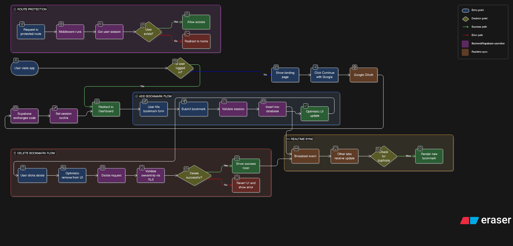

# SmartMark — Smart Bookmark App

A minimalist bookmark manager built with Next.js, Supabase, and Tailwind CSS. Save, organize, and access your bookmarks in real-time across all devices.

🔗 **Live URL:** <https://smart-bookmark-app-indol-psi.vercel.app/>

---

## Architecture



```

## Features

- **Google OAuth** — Sign in with Google, no email/password required
- **Add Bookmarks** — Save any URL with a title and category
- **Private Library** — Every user only sees their own bookmarks (Row Level Security)
- **Real-time Sync** — Bookmarks update live across multiple tabs without page refresh (Supabase Realtime)
- **Delete Bookmarks** — Remove any bookmark instantly with optimistic UI
- **Search** — Filter bookmarks by title or URL
- **Categories** — Tag bookmarks as General, Work, or Reference
- **Dark / Light Theme** — System-aware theme toggle
- **Responsive** — Works on desktop and mobile

---

## Tech Stack

| Layer | Technology |
|---|---|
| Framework | Next.js 14 (App Router) |
| Auth + Database | Supabase (Google OAuth, PostgreSQL, Realtime) |
| Styling | Tailwind CSS + shadcn/ui |
| Deployment | Vercel |
| Language | TypeScript |

---

## Project Structure

```

smart-bookmark-app/
├── app/
│   ├── api/bookmarks/route.ts     # REST API — GET, POST, DELETE
│   ├── auth/callback/route.ts     # OAuth callback handler
│   ├── bookmarks/page.tsx         # Protected dashboard (SSR)
│   ├── globals.css                # shadcn CSS variables
│   ├── layout.tsx                 # Root layout with ThemeProvider
│   └── page.tsx                   # Landing / login page
├── components/
│   ├── AddBookmark.tsx            # Add bookmark form
│   ├── BookmarkList.tsx           # Realtime bookmark list + cards
│   ├── GoogleSignInButton.tsx     # OAuth trigger button
│   ├── SignOutButton.tsx          # Sign out
│   ├── ThemeToggle.tsx            # Dark/light toggle
│   └── ui/                        # shadcn components
├── lib/
│   ├── supabase/
│   │   ├── client.ts              # Browser Supabase client
│   │   ├── server.ts              # Server Supabase client
│   │   └── middleware.ts          # Session refresh + route guard
│   └── utils.ts                   # cn() utility
├── middleware.ts                   # Protects /bookmarks route
└── types/index.ts                  # Bookmark type

```

---

## Database Schema

```sql
create table bookmarks (
  id uuid default gen_random_uuid() primary key,
  user_id uuid references auth.users(id) on delete cascade not null,
  url text not null,
  title text not null,
  category text default 'general',
  created_at timestamptz default now() not null
);

-- Row Level Security
alter table bookmarks enable row level security;

create policy "Users can read own bookmarks"
  on bookmarks for select using (auth.uid() = user_id);

create policy "Users can insert own bookmarks"
  on bookmarks for insert with check (auth.uid() = user_id);

create policy "Users can delete own bookmarks"
  on bookmarks for delete using (auth.uid() = user_id);
```

---

## Getting Started

### 1. Clone the repo

```bash
git clone https://github.com/your-username/smart-bookmark-app.git
cd smart-bookmark-app
```

### 2. Install dependencies

```bash
npm install
```

### 3. Set up environment variables

Create `.env.local` in the project root:

```env
NEXT_PUBLIC_SUPABASE_URL=your-supabase-project-url
NEXT_PUBLIC_SUPABASE_ANON_KEY=your-supabase-anon-key
```

### 4. Set up Supabase

- Create a project at [supabase.com](https://supabase.com)
- Run the SQL schema above in the SQL Editor
- Enable Realtime on the `bookmarks` table (Database → Replication)
- Enable Google OAuth (Authentication → Providers → Google)

### 5. Run locally

```bash
npm run dev
```

Open [http://localhost:3000](http://localhost:3000)

---

## Deployment

Deployed on Vercel. To deploy your own:

```bash
npm install -g vercel
vercel
```

Add the two `NEXT_PUBLIC_*` environment variables in Vercel → Settings → Environment Variables, then redeploy.

---

## Problems Encountered & How I Solved Them

### 1. `cookies()` must be awaited in Next.js 15

**Problem:** `TypeError: cookieStore.getAll is not a function` — Next.js 15 changed `cookies()` from synchronous to a Promise.

**Fix:** Added `await` before `cookies()` in `lib/supabase/server.ts` and made `createClient()` an async function. Then updated every call site to `await createClient()`.

---

### 2. Google OAuth 400 error on mobile

**Problem:** Getting a 400 error when trying to sign in from a mobile device.

**Fix:** Added the deployed Vercel URL to both Google Console's Authorized Redirect URIs and Supabase's Redirect URL allowlist. Also added the JavaScript origin to Google Console.

---

### 3. Realtime duplicate inserts

**Problem:** When adding a bookmark, the optimistic UI insert and the Supabase Realtime INSERT event both fired, causing duplicates in the list.

**Fix:** Added a deduplication check in the Realtime handler — before inserting from the socket event, check if the bookmark ID already exists in state and skip if so.

---

### 4. Environment variables not loading on Vercel

**Problem:** App worked locally but showed internal server error after deployment.

**Fix:** Environment variables from `.env.local` don't auto-deploy to Vercel. Manually added both `NEXT_PUBLIC_SUPABASE_URL` and `NEXT_PUBLIC_SUPABASE_ANON_KEY` in Vercel → Settings → Environment Variables, then redeployed.

---

### 5. Category filter chips not working

**Problem:** Work and Reference filter chips had no effect — all bookmarks were saved as "general".

**Fix:** Two-part fix — added a `category` column to the database via `ALTER TABLE`, and updated the API route's POST handler to destructure and insert `category` from the request body.

---

### 6. Middleware deprecation warning

**Problem:** `⚠ The "middleware" file convention is deprecated.`

**Fix:** Renamed `middleware.ts` to `proxy.ts` as required by Next.js 15.

---

## Author

Built by **Jagruti** ❤️
